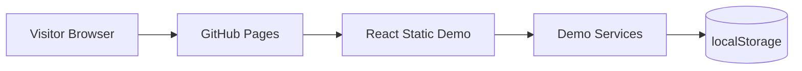
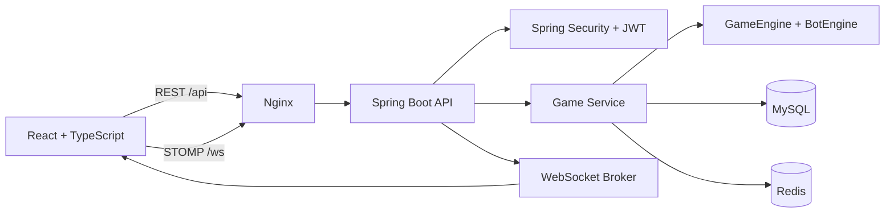

# Tic-Tac-Toe Full-Stack Portfolio App


A production-style Tic-Tac-Toe application built with Java Spring Boot, React, TypeScript, WebSocket/STOMP, MySQL, Redis, Docker, and GitHub Actions.

The public GitHub Pages site is a frontend-only demo that works without the backend. The Spring Boot backend remains in the repository for local development or separate deployment later.

## Live Demo

- Frontend Demo: https://tictactoe.mycloudcampus.in

Note: The public GitHub Pages version runs in frontend-only demo mode. The Spring Boot backend is included in this repository and can be run locally or deployed separately.

## Live Links

- Frontend Demo: `https://tictactoe.mycloudcampus.in`
- Backend API: optional, deploy separately
- API health: optional, deploy separately

## Features

- User registration and login with JWT
- BCrypt password hashing
- Protected REST API endpoints
- WebSocket/STOMP real-time game updates
- Multiplayer room create/join flow
- Bot mode with easy random play and hard minimax play
- Undo and restart support
- Match history and player profile stats
- Public local-only frontend demo mode
- Static GitHub Pages demo with localStorage-backed bot, local multiplayer, history, and stats
- Redis-backed live board cache
- MySQL persistence with JPA validation-ready DDL
- Docker and Docker Compose setup
- GitHub Actions CI, Docker image build, and GitHub Pages deploy

## Architecture

Public GitHub Pages demo:



Optional full-stack/live backend:



Backend package flow:

```text
controller -> service -> repository -> MySQL
                 |
                 -> engine
                 -> security
                 -> Redis
```

Board format:

```text
"_________"  // 9 cells, row-major, _ means empty
```

## Tech Stack

| Area | Technology |
| --- | --- |
| Backend | Java 17, Spring Boot 3.2.3, Spring Web, Spring Security, Spring WebSocket |
| Data | Spring Data JPA, MySQL 8, Redis 7 |
| Auth | JWT with jjwt, BCrypt |
| Frontend | React 18, TypeScript, Vite 8, Redux Toolkit, React Router, Axios |
| Realtime | STOMP over SockJS |
| Styling | Tailwind CSS |
| Infra | Docker, Docker Compose, Nginx, GHCR |
| CI/CD | GitHub Actions, GitHub Pages |

## Project Structure

```text
tic-tac-toe/
├── backend/                 # Spring Boot API
├── frontend/                # React/Vite frontend
├── docs/                    # Architecture, demo mode, deployment, DDL, screenshots
├── .github/workflows/       # CI/CD and GitHub Pages workflows
├── docker-compose.yml       # Local full-stack Docker setup
├── docker-compose.prod.yml  # Production Docker Compose setup
└── README.md
```

## Prerequisites

- Java 17+
- Maven 3.9+
- Node.js 20+
- Docker 24+ and Docker Compose v2
- MySQL 8 and Redis 7 if running without Docker

## Local Setup

### 1. Clone

```bash
git clone https://github.com/uttamkumar37/tic-tac-toe.git
cd tic-tac-toe
```

### 2. Backend Environment

```bash
cp backend/.env.example backend/.env
```

Set a real JWT secret:

```text
JWT_SECRET=use-at-least-32-random-bytes-here
```

The Spring app reads environment variables from your shell, Docker, IDE run config, or deployment platform. Do not commit `.env`.

### 3. Backend

```bash
cd backend
mvn clean test
mvn spring-boot:run
```

Backend runs on:

```text
http://localhost:8080
```

### 4. Frontend Environment

```bash
cp frontend/.env.example frontend/.env.local
```

Default local values:

```text
VITE_APP_MODE=live
VITE_API_BASE_URL=http://localhost:8080/api
VITE_WS_BASE_URL=http://localhost:8080/ws
VITE_BASE_PATH=/
```

For frontend-only demo mode, leave the backend URLs empty:

```text
VITE_APP_MODE=demo
VITE_API_BASE_URL=
VITE_WS_BASE_URL=
VITE_BASE_PATH=/
```

### 5. Frontend

```bash
cd frontend
npm ci
npm run dev
```

Frontend runs on:

```text
http://localhost:5173
```

## Docker Compose

Create a root environment file:

```bash
cp .env.example .env
```

Edit all placeholder values, especially:

```text
MYSQL_ROOT_PASSWORD
MYSQL_PASSWORD
REDIS_PASSWORD
JWT_SECRET
CORS_ALLOWED_ORIGINS
```

Start the full stack:

```bash
docker compose --env-file .env up --build
```

Frontend:

```text
http://localhost
```

Backend:

```text
http://localhost:8080
```

## Environment Variables

### Backend

See [backend/.env.example](backend/.env.example).

| Variable | Purpose |
| --- | --- |
| `DATABASE_URL` | JDBC URL for MySQL |
| `DB_USERNAME` | Database user |
| `DB_PASSWORD` | Database password |
| `REDIS_HOST` | Redis hostname |
| `REDIS_PORT` | Redis port |
| `REDIS_PASSWORD` | Redis password, blank only for local development |
| `JWT_SECRET` | At least 32 random bytes |
| `JWT_EXPIRATION_MS` | JWT lifetime in milliseconds |
| `CORS_ALLOWED_ORIGINS` | Comma-separated trusted frontend origins |

### Frontend

See [frontend/.env.example](frontend/.env.example).

| Variable | Purpose |
| --- | --- |
| `VITE_APP_MODE` | `demo` for browser-only public demo, `live` for backend mode |
| `VITE_API_BASE_URL` | Backend API base URL |
| `VITE_WS_BASE_URL` | Backend SockJS/STOMP endpoint |
| `VITE_BASE_PATH` | Static hosting base path, such as `/tic-tac-toe/` |

## Documentation

- [Demo Mode](docs/DEMO_MODE.md)
- [Architecture](docs/ARCHITECTURE.md)
- [Deployment](docs/DEPLOYMENT.md)

## API Documentation

All endpoints except `/api/auth/**` and `/actuator/health` require:

```http
Authorization: Bearer <jwt>
```

### Auth

| Method | Path | Description |
| --- | --- | --- |
| `POST` | `/api/auth/register` | Register user |
| `POST` | `/api/auth/login` | Login and receive JWT |

Register body:

```json
{
  "username": "alice",
  "email": "alice@example.com",
  "password": "secret123"
}
```

Login body:

```json
{
  "username": "alice",
  "password": "secret123"
}
```

### Games

| Method | Path | Description |
| --- | --- | --- |
| `POST` | `/api/games` | Create bot or multiplayer game |
| `GET` | `/api/games/open` | List waiting multiplayer rooms |
| `GET` | `/api/games/{roomCode}` | Get game state for a participant |
| `POST` | `/api/games/{roomCode}/join` | Join waiting multiplayer room |
| `POST` | `/api/games/move` | Make a move |
| `POST` | `/api/games/{roomCode}/undo` | Undo move |
| `POST` | `/api/games/{roomCode}/restart` | Restart game |

Create multiplayer:

```json
{
  "mode": "MULTIPLAYER"
}
```

Create bot game:

```json
{
  "mode": "BOT",
  "botDifficulty": "HARD"
}
```

### Users

| Method | Path | Description |
| --- | --- | --- |
| `GET` | `/api/users/me` | Private profile, includes email |
| `GET` | `/api/users/{username}` | Public profile, excludes email |

### History

| Method | Path | Description |
| --- | --- | --- |
| `GET` | `/api/history?page=0&size=10` | Authenticated user's match history |

## WebSocket

Endpoint:

```text
/ws
```

STOMP connect headers:

```http
Authorization: Bearer <jwt>
```

Subscribe:

| Destination | Description |
| --- | --- |
| `/topic/game/{roomCode}` | Game state updates |
| `/user/queue/errors` | Per-user errors |

Send:

| Destination | Body |
| --- | --- |
| `/app/game.move` | `{ "roomCode": "AB12CD34", "position": 4 }` |
| `/app/game.undo` | `{ "roomCode": "AB12CD34" }` |
| `/app/game.restart` | `{ "roomCode": "AB12CD34" }` |

## Testing

Backend:

```bash
cd backend
mvn clean test
```

Frontend:

```bash
cd frontend
npm ci
npm run build
npm audit --audit-level=moderate
```

Docker config:

```bash
docker compose --env-file .env.example config
docker compose --env-file .env.example -f docker-compose.prod.yml config
```

## Deployment

### Frontend: GitHub Pages

The `GitHub Pages` workflow builds and deploys only the static frontend demo to:

```text
https://tictactoe.mycloudcampus.in
```

The workflow uses demo mode:

```text
VITE_APP_MODE=demo
VITE_API_BASE_URL=
VITE_WS_BASE_URL=
VITE_BASE_PATH=/
```

Enable Pages:

1. Go to repository Settings.
2. Open Pages.
3. Select GitHub Actions as the source.
4. Push to `main`.

Custom domain DNS:

| Type | Host/Name | Value/Target |
| --- | --- | --- |
| CNAME | `tictactoe` | `uttamkumar37.github.io` |

### Backend: Render, Railway, Fly.io

Deploy the backend separately. See [docs/DEPLOYMENT.md](docs/DEPLOYMENT.md).

Required backend services:

- MySQL
- Redis
- HTTPS-capable public backend host

### Docker Compose Production

Use [docker-compose.prod.yml](docker-compose.prod.yml) on a VPS:

```bash
cp .env.example .env
docker compose -f docker-compose.prod.yml --env-file .env up -d
```

Use real secrets and a TLS reverse proxy for public deployment.

## Security Notes

- JWT secret must be configured and at least 32 bytes.
- WebSocket `CONNECT` validates JWT and sets the authenticated user principal.
- Game reads and mutations are limited to `playerX` and `playerO`.
- Bot games can only be read, undone, and restarted by the owner.
- Public profiles do not expose email addresses.
- Production actuator exposure is limited to health.
- `.env`, `.env.local`, and generated build outputs are ignored.
- Do not publish real credentials in issues, screenshots, or commits.

## Database Schema

The production DDL is in [docs/db-schema.sql](docs/db-schema.sql).

The schema is aligned with JPA validation, including:

- `game_history.player_x_id`
- `game_history.player_o_id`
- `games.version` for optimistic locking

## Roadmap

- End-to-end Playwright tests
- Testcontainers MySQL and Redis integration tests
- Spectator mode
- Leaderboard
- Password reset flow
- Refresh tokens
- Broker relay for horizontal WebSocket scaling

## Known Limitations

- GitHub Pages hosts only the static frontend.
- The backend must be deployed separately.
- The WebSocket broker is in-memory and intended for one backend instance.
- The local-only demo does not persist games or call the backend.
- Testcontainers are not yet wired into CI.

## Screenshots

Add screenshots under [docs/screenshots](docs/screenshots).

Recommended files:

- `landing.png`
- `demo.png`
- `lobby.png`
- `bot-game.png`
- `multiplayer.png`
- `history.png`
- `profile.png`

## License

MIT. See [LICENSE](LICENSE).

## Author

**Uttam Kumar**

Java Backend Developer

- GitHub: `https://github.com/uttamkumar37/tic-tac-toe`
- LinkedIn: `https://linkedin.com/in/YOUR_LINKEDIN_USERNAME`
