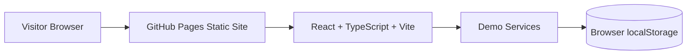
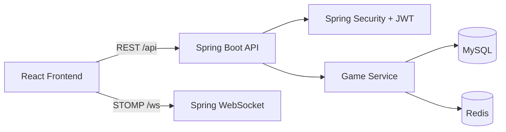

# Architecture

## Public GitHub Pages Architecture



The public site at `https://tictactoe.mycloudcampus.in` is a static frontend. It does not call a backend unless live API environment variables are configured.

## Optional Live Architecture



## Mode Selection

The frontend reads `frontend/src/config/appConfig.ts`.

```text
VITE_APP_MODE=demo
```

forces browser-only demo mode.

```text
VITE_APP_MODE=live
VITE_API_BASE_URL=https://...
VITE_WS_BASE_URL=https://...
```

uses the real backend integration.

## Why This Split Exists

GitHub Pages cannot host Java, MySQL, Redis, or WebSocket server processes. Hosting only the frontend makes the public portfolio demo reliable and inexpensive while preserving the full-stack backend for local development or separate production deployment.
